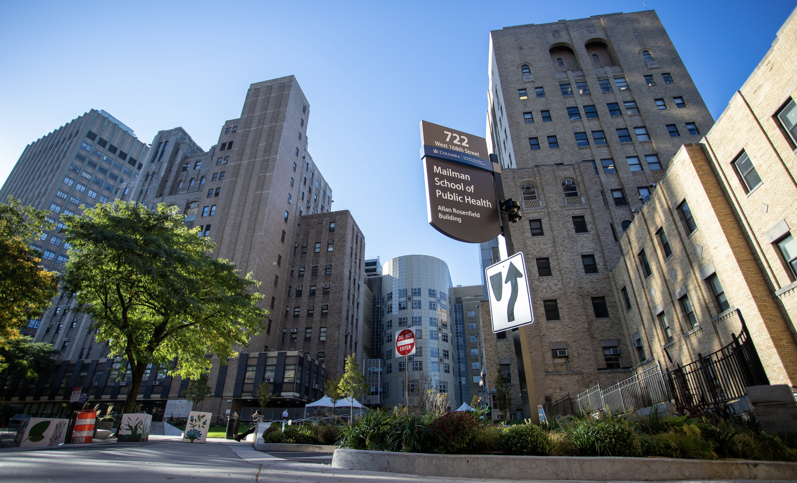

```{r setup, include = FALSE}
library(tidyverse)
library(viridis)
library(plotly)

knitr::opts_chunk$set(
	message = FALSE,
	warning = FALSE,
	fig.width = 10,
  out.width = "80%"
)

options(
  ggplot2.continuous.colour = "viridis",
  ggplot2.continuous.fill = "viridis"
)

scale_colour_discrete = scale_colour_viridis_d
scale_fill_discrete = scale_fill_viridis_d

theme_set(theme_minimal() + theme(legend.position = "bottom"))
```

<center></center>

\ \par

In this section we would like to briefly analyze the crime complaints that happen near CUMC campus.

