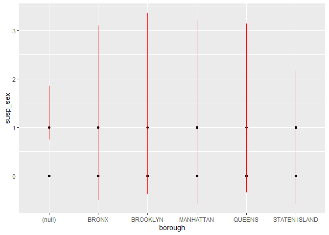
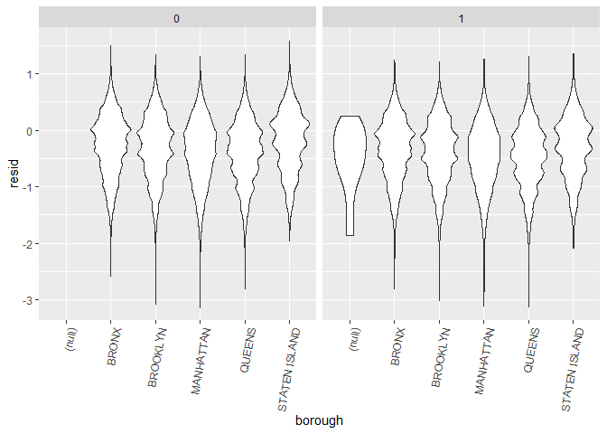
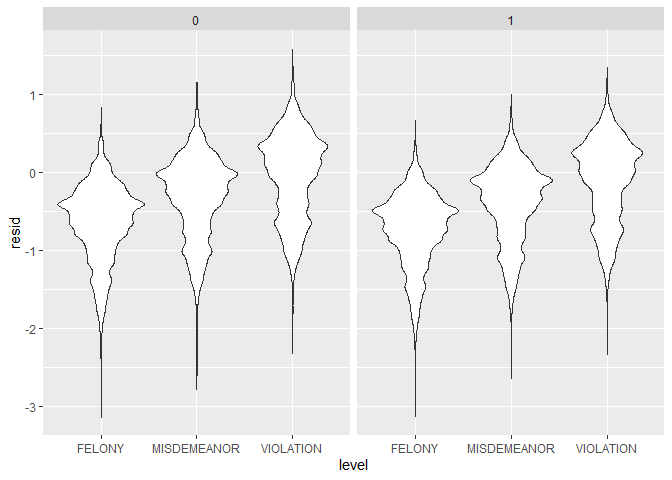
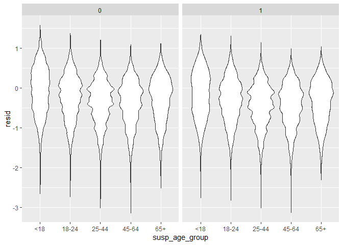
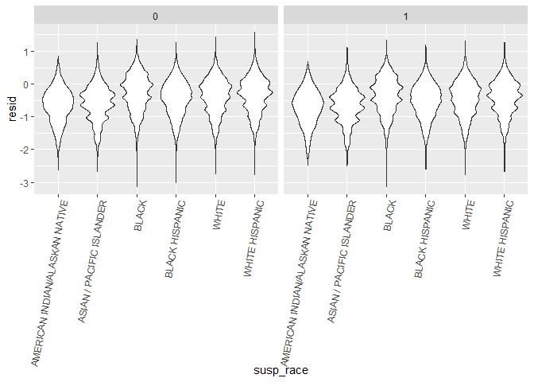
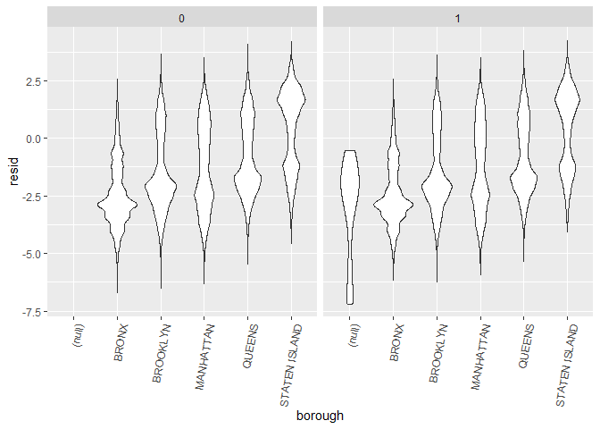
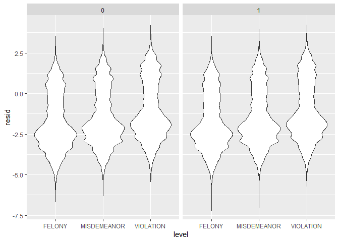
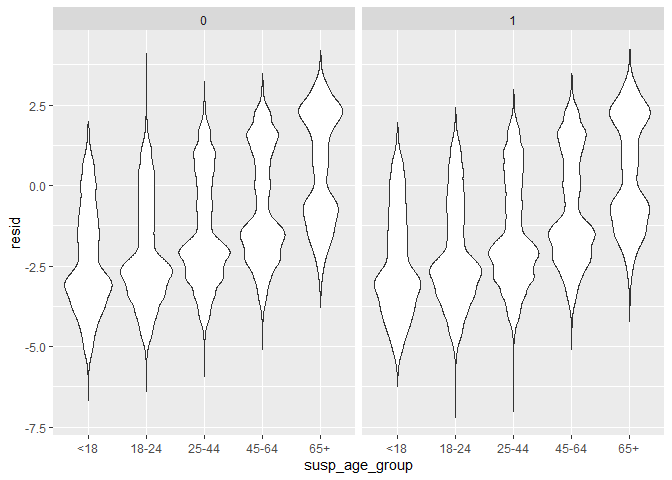

Hongrutang
================
ht2611
2022-12-03

## data clean

``` r
library(tidyverse)
```

    ## ── Attaching packages ─────────────────────────────────────── tidyverse 1.3.2 ──
    ## ✔ ggplot2 3.3.6      ✔ purrr   0.3.4 
    ## ✔ tibble  3.1.8      ✔ dplyr   1.0.10
    ## ✔ tidyr   1.2.0      ✔ stringr 1.4.1 
    ## ✔ readr   2.1.2      ✔ forcats 0.5.2 
    ## ── Conflicts ────────────────────────────────────────── tidyverse_conflicts() ──
    ## ✖ dplyr::filter() masks stats::filter()
    ## ✖ dplyr::lag()    masks stats::lag()

``` r
library(purrr)
library(modelr)
library(dbplyr)
```

    ## 
    ## 载入程辑包：'dbplyr'
    ## 
    ## The following objects are masked from 'package:dplyr':
    ## 
    ##     ident, sql

``` r
library(plyr)
```

    ## ------------------------------------------------------------------------------
    ## You have loaded plyr after dplyr - this is likely to cause problems.
    ## If you need functions from both plyr and dplyr, please load plyr first, then dplyr:
    ## library(plyr); library(dplyr)
    ## ------------------------------------------------------------------------------
    ## 
    ## 载入程辑包：'plyr'
    ## 
    ## The following objects are masked from 'package:dplyr':
    ## 
    ##     arrange, count, desc, failwith, id, mutate, rename, summarise,
    ##     summarize
    ## 
    ## The following object is masked from 'package:purrr':
    ## 
    ##     compact

``` r
setwd(dir="D:/P8105_Final_Project/Data_preprocessing/data")
a <- list.files()     
a 
```

    ## [1] "cleaned_NYPD_2016.csv" "cleaned_NYPD_2017.csv" "cleaned_NYPD_2018.csv"
    ## [4] "cleaned_NYPD_2019.csv" "cleaned_NYPD_2020.csv" "cleaned_NYPD_2021.csv"
    ## [7] "cleaned_NYPD_2022.csv"

``` r
dir <- paste("./",a,sep="")                 

n <- length(dir) 

merge_data <- read.csv(file = dir[1],header=T,sep=",")   
merge_data <- cbind(dir[1], merge_data )
merge_data <- rename(merge_data, c("dir[1]"="yyyymm"))

for (i in 2:7){
  new.data <- read.csv(file = dir[i], header=T, sep=",")
  new.data <- cbind(dir[i], new.data)
  new.data <- rename(new.data, c("dir[i]"="yyyymm"))
  merge_data <- rbind(merge_data,new.data)
}
```

## data clean, drop data with unknown

``` r
# filter data with unknown
tidydata1=merge_data%>%
  na.omit()%>%
  filter(!susp_sex=="U")%>%
  filter(!susp_race=="UNKNOWN")%>%
  filter(!susp_age_group=="UNKNOWN")%>%
   filter(!vic_race=="UNKNOWN")%>%
  filter(!vic_age_group=="UNKNOWN")%>%
  separate(date,into=c("mon","day","year"),sep="/")%>%
  mutate(jurisdiction_code=as.numeric(jurisdiction_code))%>%
  mutate(susp_sex=ifelse(susp_sex=="M",1,0),vic_sex=ifelse(vic_sex=="M",1,0),jurisdiction_code=ifelse(jurisdiction_code>=3,3,jurisdiction_code+0))%>%
  mutate(jurisdiction_code=as.factor(jurisdiction_code))%>%
  mutate(covid_state=ifelse(year>=2020,1,0))
# when year >=2020, we assume the world is in a covid state.
```

## susp sex is a predictor, use logisitc regression

``` r
mylogit <- glm(susp_sex ~ precinct
 + borough + jurisdiction_code+atpt_cptd
+level+susp_age_group
+susp_race+vic_age_group+vic_race+vic_sex+covid_state, data = tidydata1, family = "binomial")
# almost full model except victor information
mylogit%>%
  broom::tidy() %>% 
  select(term, estimate, p.value)
```

    ## # A tibble: 33 × 3
    ##    term                 estimate   p.value
    ##    <chr>                   <dbl>     <dbl>
    ##  1 (Intercept)           1.53    8.02e-  3
    ##  2 precinct             -0.00347 4.29e- 22
    ##  3 boroughBRONX          0.468   4.13e-  1
    ##  4 boroughBROOKLYN       0.620   2.79e-  1
    ##  5 boroughMANHATTAN      0.459   4.23e-  1
    ##  6 boroughQUEENS         0.743   1.94e-  1
    ##  7 boroughSTATEN ISLAND  0.628   2.73e-  1
    ##  8 jurisdiction_code1    0.678   6.07e-206
    ##  9 jurisdiction_code2   -0.153   1.73e- 86
    ## 10 jurisdiction_code3   -0.0470  1.35e-  1
    ## # … with 23 more rows

For backward stepwise, in order to select variables.

``` r
step(mylogit, direction='backward')
```

    ## Start:  AIC=986315.5
    ## susp_sex ~ precinct + borough + jurisdiction_code + atpt_cptd + 
    ##     level + susp_age_group + susp_race + vic_age_group + vic_race + 
    ##     vic_sex + covid_state
    ## 
    ##                     Df Deviance    AIC
    ## <none>                   986249 986315
    ## - precinct           1   986343 986407
    ## - atpt_cptd          1   986402 986466
    ## - covid_state        1   986506 986570
    ## - borough            5   986589 986645
    ## - susp_race          5   986947 987003
    ## - jurisdiction_code  3   987798 987858
    ## - vic_age_group      4   987952 988010
    ## - susp_age_group     4   987986 988044
    ## - vic_sex            1   988688 988752
    ## - vic_race           5   992110 992166
    ## - level              2   998154 998216

    ## 
    ## Call:  glm(formula = susp_sex ~ precinct + borough + jurisdiction_code + 
    ##     atpt_cptd + level + susp_age_group + susp_race + vic_age_group + 
    ##     vic_race + vic_sex + covid_state, family = "binomial", data = tidydata1)
    ## 
    ## Coefficients:
    ##                       (Intercept)                           precinct  
    ##                          1.525072                          -0.003474  
    ##                      boroughBRONX                    boroughBROOKLYN  
    ##                          0.468241                           0.619915  
    ##                  boroughMANHATTAN                      boroughQUEENS  
    ##                          0.458813                           0.743427  
    ##              boroughSTATEN ISLAND                 jurisdiction_code1  
    ##                          0.627991                           0.677619  
    ##                jurisdiction_code2                 jurisdiction_code3  
    ##                         -0.152851                          -0.046952  
    ##                atpt_cptdCOMPLETED                   levelMISDEMEANOR  
    ##                         -0.275581                          -0.384118  
    ##                    levelVIOLATION                susp_age_group18-24  
    ##                         -0.747449                           0.059370  
    ##               susp_age_group25-44                susp_age_group45-64  
    ##                          0.259121                           0.355220  
    ##                 susp_age_group65+  susp_raceASIAN / PACIFIC ISLANDER  
    ##                          0.322764                          -0.227803  
    ##                    susp_raceBLACK            susp_raceBLACK HISPANIC  
    ##                         -0.149805                          -0.091082  
    ##                    susp_raceWHITE            susp_raceWHITE HISPANIC  
    ##                         -0.304785                          -0.296770  
    ##                vic_age_group18-24                 vic_age_group25-44  
    ##                          0.391673                           0.276877  
    ##                vic_age_group45-64                   vic_age_group65+  
    ##                          0.190445                           0.005028  
    ##  vic_raceASIAN / PACIFIC ISLANDER                      vic_raceBLACK  
    ##                          0.094760                          -0.581278  
    ##            vic_raceBLACK HISPANIC                      vic_raceWHITE  
    ##                         -0.375859                          -0.072595  
    ##            vic_raceWHITE HISPANIC                            vic_sex  
    ##                         -0.181335                          -0.258387  
    ##                       covid_state  
    ##                          0.081495  
    ## 
    ## Degrees of Freedom: 891833 Total (i.e. Null);  891801 Residual
    ## Null Deviance:       1015000 
    ## Residual Deviance: 986200    AIC: 986300

Through backward, we found that we need all the variables.(lasso?)

``` r
# 此图不要
tidydata1 %>% 
  add_predictions(mylogit) %>% 
  ggplot(aes(x = borough, y = susp_sex)) + geom_point() + 
  geom_line(aes(y = pred), color = "red")
```

<!-- -->

``` r
tidydata1 %>% 
  modelr::add_residuals(mylogit) %>% 
  ggplot(aes(x = borough, y = resid)) + geom_violin()+
   facet_wrap(~covid_state)+theme(axis.text.x = element_text(angle = 80, hjust = 1))
```

<!-- -->

``` r
tidydata1 %>% 
  modelr::add_residuals(mylogit) %>% 
  ggplot(aes(x = level, y = resid)) + geom_violin()+facet_wrap(~covid_state)
```

<!-- -->

``` r
tidydata1 %>% 
  modelr::add_residuals(mylogit) %>% 
  ggplot(aes(x = susp_age_group, y = resid)) + geom_violin()+facet_wrap(~covid_state)
```

<!-- -->

``` r
tidydata1 %>% 
  modelr::add_residuals(mylogit) %>% 
  ggplot(aes(x = susp_race, y = resid)) + geom_violin()+
  theme(axis.text.x = element_text(angle = 80, hjust = 1))+facet_wrap(~covid_state)
```

<!-- -->

## susp race is a predictor

``` r
# There are lot of race, we only focus on white and black
tidydata2=tidydata1%>%
  filter(susp_race %in% c("BLACK","WHITE"))%>%
  mutate(susp_race=ifelse(susp_race=="BLACK",1,0))
```

``` r
mylogit_2=glm(susp_race ~ precinct
 + borough + jurisdiction_code+atpt_cptd
+level+susp_age_group
+susp_sex+vic_age_group+vic_race+vic_sex, data = tidydata2, family = "binomial")
# almost full model except victor information
mylogit_2%>%
  broom::tidy() %>% 
  select(term, estimate, p.value)
```

    ## # A tibble: 28 × 3
    ##    term                 estimate  p.value
    ##    <chr>                   <dbl>    <dbl>
    ##  1 (Intercept)            3.05   4.29e- 3
    ##  2 precinct               0.0245 0       
    ##  3 boroughBRONX          -0.910  3.94e- 1
    ##  4 boroughBROOKLYN       -2.37   2.65e- 2
    ##  5 boroughMANHATTAN      -0.893  4.03e- 1
    ##  6 boroughQUEENS         -3.54   9.13e- 4
    ##  7 boroughSTATEN ISLAND  -4.42   3.55e- 5
    ##  8 jurisdiction_code1     1.46   0       
    ##  9 jurisdiction_code2     1.28   0       
    ## 10 jurisdiction_code3     0.629  1.47e-31
    ## # … with 18 more rows

``` r
tidydata2 %>% 
  modelr::add_residuals(mylogit_2) %>% 
  ggplot(aes(x = borough, y = resid)) + geom_violin()+facet_wrap(~covid_state)+theme(axis.text.x = element_text(angle = 80, hjust = 1))
```

<!-- -->

``` r
tidydata2 %>% 
  modelr::add_residuals(mylogit_2) %>% 
  ggplot(aes(x = level, y = resid)) + geom_violin()+facet_wrap(~covid_state)
```

<!-- -->

``` r
tidydata2 %>% 
  modelr::add_residuals(mylogit_2) %>% 
  ggplot(aes(x = susp_age_group, y = resid)) + geom_violin()+facet_wrap(~covid_state)
```

<!-- -->
