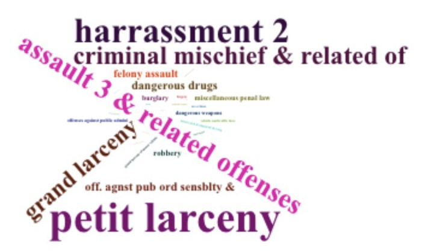
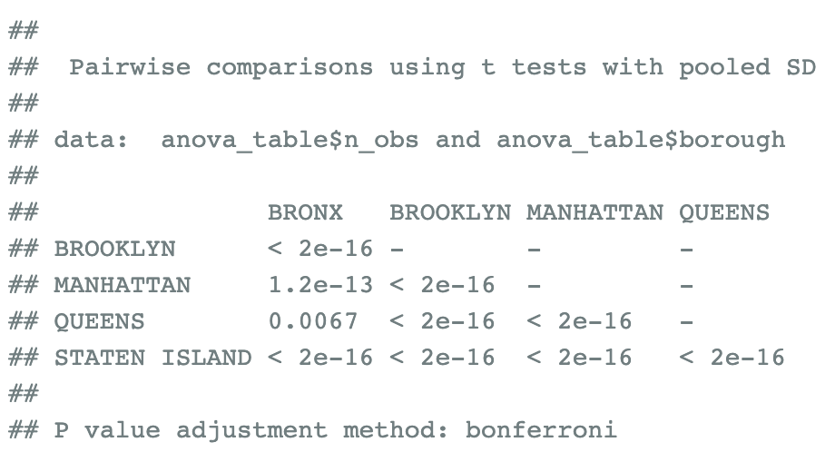
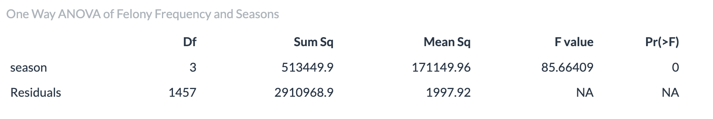
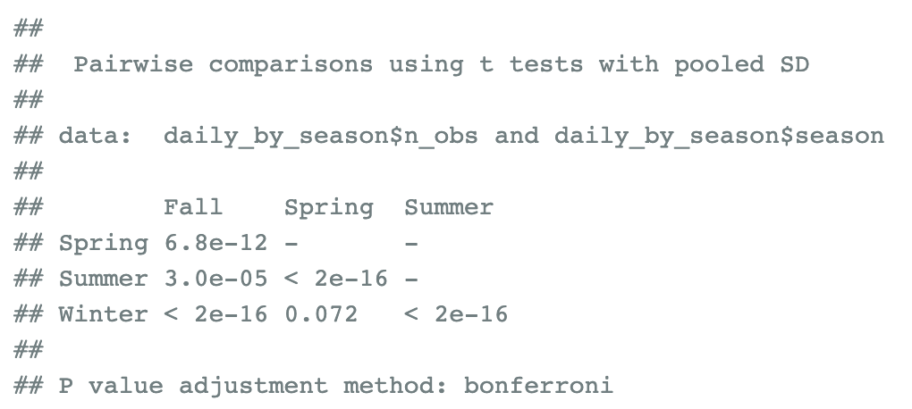
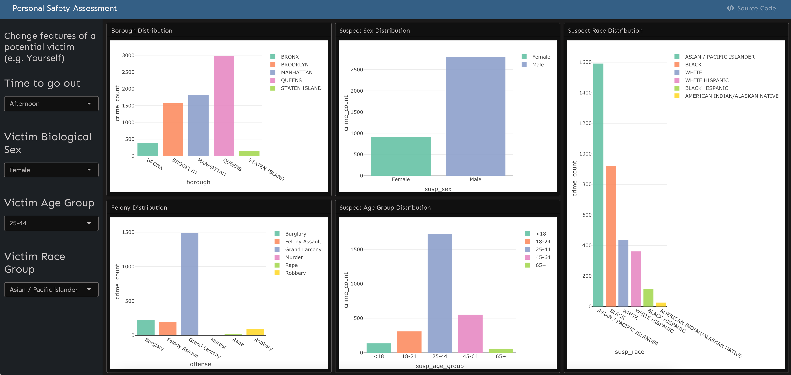

```{r setup, include = FALSE}
library(tidyverse)
library(viridis)
library(plotly)

knitr::opts_chunk$set(
	message = FALSE,
	warning = FALSE,
	fig.width = 10,
  out.width = "80%"
)

options(
  ggplot2.continuous.colour = "viridis",
  ggplot2.continuous.fill = "viridis"
)

scale_colour_discrete = scale_colour_viridis_d
scale_fill_discrete = scale_fill_viridis_d

theme_set(theme_minimal() + theme(legend.position = "bottom"))
```

<center></center>

\ \par

## Motivation
Motivation: As international students who have just come to U.S. for four months, personal safety is our most important and most concerned issue. To be honest, New York City is not as safe as we thought. We can get information about assaults or shoots from various sources. Meanwhile, we also heard that the crime rate in New York has increased significantly after Covid-19. Our project aims to investigate whether the rumor is true and tries to find any pattern related to crimes in New York City.

## Related Work
Related work: One of our group members recently downloaded an app called ‘Citizen’, which will alert you if there is any incident around you. It also provides a map highlighting recent cases. This is where our inspiration comes from. What’s more, we previously did Problem 2 in Homework 5, which contains a dataset gathering homicide information in 50 large U.S. cities. That dataset also gives us inspiration about what we can do with it. There is one more interesting thing. In the process of doing the project, it reminds one group member of a drama named ‘Person of Interest’ he watched before. In each episode, the machine gives out a social security number, and the person with the SSN will experience a crime. The machine is doing a job of calculating everyone’s risk of being involved in a crime, and we want to do that as well, predicting a person's risk based on his characteristics.

## Data Source
Data: At first, we tried to reach out to Citizen App to see whether they could share the dataset with us. Unfortunately, they refused such a request. Then we searched for open dataset recording crimes in New York City and got this final historic dataset. The raw dataset has 34 variables, and we want to select meaningful and valuable ones. We got rid of redundant variables or the ones with little information to keep the whole dataset and tidy. For data cleaning, we separated `date` into `year`, `month`, and `day`, and separated time of the day into `hour` and `min`. Besides, we found out that the data size for `00:01:00` is disproportionately large compared to the other time values. We assumed `00:01:00` is the default value for `time`, so we set the `hour` and `minute` of these rows to be `NA` values in order not to yield results not reflecting the real situations. We then added variables `day_of_week `, `hour`, and `covid_state` for EDA and statistical tests. Finally, we set all the unknown or incomprehensible values to be `NA` values.
Key variables that were used in our analyses include:  

 

* `level`: level of offense: felony, misdemeanor, and violation
* `offense`: type of offense
* `susp_age_group`: suspect’s age group
* `susp_race`: suspect’s race
* `susp_sex`: suspect’s sex
* `vic_age_group`: victim’s age group
* `vic_race`: victim’s race
* `vic_sex`: victim’s sex
* `borough`
* `longitude`
* `latitude`
* `year`
* `month`
* `day_of_week `: day of the week
* `hour`
* `covid_state`: before vs during the COVID-19 pandemic


## Data-driven Analysis

### Initial questions
First, we hope to find the relationship between crime level, places, time and other things with the suspect information. There are some variables that can reflect the suspects’ information: `susp_age_group`, `susp_sex` and `susp_race`. `Susp_age_group` means the age distribution of suspects. According to the age of the suspects, we divided them into five groups. `Susp_sex` means the gender of suspect. `Susp_race` means the race of suspect. There are totally six kinds of race, and we are most interested in the differences between the yellow race which is Asian and other races.  

Then, we wish to study the relationship between crime incidents and victim attributes. By observing the data, we found that the variables that can reflect the attributes of the victim are: `vic_race`, `vic_age`, `vic_sex`, which respectively represent the race, age and sex of the victim. Criminal events are defined as violations, misdemeanors, and felonies. We will discuss this issue by observing whether the severity of the case is related to the victim's race, age range, and gender.  

After that, we are trying to dig out the relationship between cases and regions.  
The first thing is to define how to evaluate cases. We now have the total number of complaints recorded from 2016 to 2022, but does the dataset truly record all the cases? We think this question can be raised to every dataset, and even though it is not completely recorded, it represents a perfect sample of the population.  

Initially, we would like to get the probability that the crime will happen. Then we realized that it was impossible because we only have the recorded cases, and we don’t have safe situations. That might be a publication bias, and we could not get the crime rate based on this dataset. Hence, we later focus on the number of cases monthly and the felony rate. We care much about felony because it has the greatest impact on our personal safety. We did the job to figure out the difference in monthly cases and felony rates between the five boroughs in New York City. We wanted to see which borough is the safest and which one is the most dangerous. Then we realized that using the borough variable may be a bit too broad. There is another variable called precinct which divides New York City into smaller areas. However, that is not a good idea to use in the comparison part because there are so many precincts. It can be used in the prediction part.

We may also want to ask what is the trend of felony frequency in NYC over time? Are there any temporal patterns of felony frequency, particularly robbery? Are there any seasonal differences? We want to explore patterns in felony frequency in NYC regarding date and time. The focus is on identifying trends related to the month, day of the week, and hour of the day. The period of interest is from 2016 to September 2022, with a specific focus on changes before and during the COVID-19 pandemic.


### Exploratory analysis
We will first use data visualization to give an overview of the distribution of suspect’s features. We draw plots according to suspect’s sex, race, and age group.

For the second part, we draw hierarchical histograms to observe the difference in the number of different types of cases under the circumstances of different victims' gender, age and race. Since the bases of each type of occurrence time are different, the pie chart method is used to further compare the proportion of cases of different genders, youths, and races.

For the third part, we made plots to show the frequency of felonies by borough and the proportion of felonies by borough and year. We would like to see if there is any pattern that can be seen at first glance. Moreover, we also made an interactive plot using `ploy_ly` like the one discussed in class to show the borough, precinct, level, and offense on a map according to latitude and longitude. Since the dataset is too big, it’s hard to put all the data on one interactive map. Thus, we only do that using data in 2022.

At last, we create two plots showing the hourly frequency of felonies and robberies by hour of the day and day of the week. 

Relevant plots are shown below:
<center>
 
 
</center>

<center>
 
 
</center>

<center>
 
 
</center>

<center>
 
 
</center>

### Additional Analysis
We use statistical tests to find if there is a difference in daily crime records of suspects from difference races. And according to the test results, we can find that there’s a significant difference between the suspect races.
We also performed a logistic regression between felony and non-felony case types and different victim characteristics to see what have a significant impact on the distribution of case types. The regression coefficients are all significant, indicating that the victim's age, gender and race information have a significant impact on the case level. What’s more, the difference in coefficient value reflects the impact of different categories of people on the case level from weak to strong. For example, `vic_race`=ASIAN/PACIFIC ISLANDER and their impact on whether the case type is finally judged as a felony is 0.406, which is significantly higher than that of `vic_race`=BLACK, which is in line with our previous analysis, that is, although the proportion of victims of the black family is relatively large, as the case level However, the degree of change in the types of victims is more significant in ASIAN/PACIFIC ISLANDER.
For the borough analysis, we performed some statistical tests to find if there is a difference in crime records from different boroughs. We used ANOVA table to analyze the differences in monthly cases and felony rates.
And in the time analysis part, we also use one-way ANOVA to test if the daily frequency of felonies is the same across the four seasons in pre-COVID years.

<center></center> 
<center></center> 
<center></center> 

## Shiny Apps
In order to make our investigation more detailed and vivid, we construct several Shiny Apps for user interaction. The first and the second are Shiny interactive maps based on data before and after covid. The third is a potential danger assessment for people who want to go out. We also develop a map for CUMC campus region, which would be included in CUMC safety analysis section.

<center>  </center>

<center>  </center>


## CUMC safety Analysis
Based on previous analysis and discussion, we take a specific look at CUMC campus region and conduct visual analysis. Meanwhile, we customized a Shiny interactive map for CUMC campus region, so as to display the crime distribution near CUMC more directly.

<center>  </center>

## Discussion: 
From the proportion of suspect sex and year, we can see that Men account for most crimes. However, after 2020, that is, after the outbreak of the epidemic, the proportion of male group crimes has decreased. We guess it may be because the epidemic has a greater psychological and physical impact on women. In the angle of crime level, the men have the largest part in felony, while in the proportion of misdemeanors and violation, the part of men has decreased.

Especially in the crime of violation, women account for more than a quarter. In the proportion of suspect race and year, the Black take the largest part of crime, second is white Hispanic, then white, the last are black Hispanic and Asian. The race proportion of suspects does not change with time. In the crime level of felony, black take larger part than misdemeanors and violation. The White are more likely to commit misdemeanors and violation, rather than felony. When refers to suspect age group, we found that people between 25 and 44 years old take the largest part of crime. This proportion is even increasing every year.  

We also did the regression of the suspect's gender and race on other variables respectively. We find that the coefficient of each variable is significant. We also found men prefer to commit crimes in borough STATEN ISLAND. They are more likely to commit crimes against age groups of 45-64 years old, sex of female and race of black. 

The gender ratio of victims at different levels is discovered. In the violation category, the ratio of male victims to females is: 35.6%: 64.4%. misdemeanor category: 47.6%: 52.4%, felony category: 47.7%: 52.3. From the results, it can be simply analyzed that when the crime type is violence, which is relatively mild, the probability of the victim being a female is significantly higher than that of a male. And when the severity of the crime type rises to misdemeanor and felony, the probability of the victim being male and female tends to be similar, and the probability of male is slightly lower than that of female. In the same way, we want to observe the differences in different age ranges and levels.  

The results show that although the victim group is mainly targeted at 25-44. In the progression of violations to misdemeanors and felonies, the 45-64 victim age group dropped about 4 percentage points and the 18-24 victim age group rose about 3 points. The same method observes the relationship between victim race and case level. The black race occupies most of the victims, and as the severity of the case increases, the proportion of black victims decreases significantly, while the proportion of white Hispanic and ASIAN/PACIFIC ISLAND victims gradually increases.

We found that Brooklyn had the most felonies, followed by Manhattan, and Bronx has about the same felonies as Queens. Staten Island has the least felonies. The proportion of felonies does not appear to have changed significantly over the years. The five boroughs do not have equal monthly cases, and the pairwise t-test further reveals each borough differs from the others on monthly cases. Based on monthly cases, from highest to lowest, Brooklyn, Manhattan, Bronx, Queens, Staten Island. Further, the five boroughs do not have equal felony rates, and the pairwise t-test further reveals that Bronx and Staten Island are different from others; Manhattan differs from Brooklyn, but does not differ from Queens; while Brooklyn does not differ from Queens either. Based on felony rate, from highest to lowest, Brooklyn, Queens, Manhattan, Bronx, Staten Island. This was somehow out of our expectations because we often heard that Bronx is the most dangerous borough. At least we could conclude that Staten Island is the safest among the five boroughs. As for the most dangerous part, we think we can investigate further on precincts, for example, East Harlem versus Washington Heights because still, analysis based on the borough is just too broad.

The felony frequency tended to be lower in colder months and higher in warmer months before 2020. During the pandemic, the felony frequency was at its lowest point in April 2020, probably due to the stay-at-home order. The frequency in 2022 significantly increases compared to previous years, reaching its highest point in June and July. Further statistical analysis revealed that Felony frequencies vary across seasons in pre-COVID years. The felony frequency is highest in the afternoon and early evening, and lowest in the early morning. On weekends, the frequency is higher in the late night compared to weekdays. The frequency of robbery is like that of felony overall, but robbery tends to be more common during the late-night hours on weekends.


