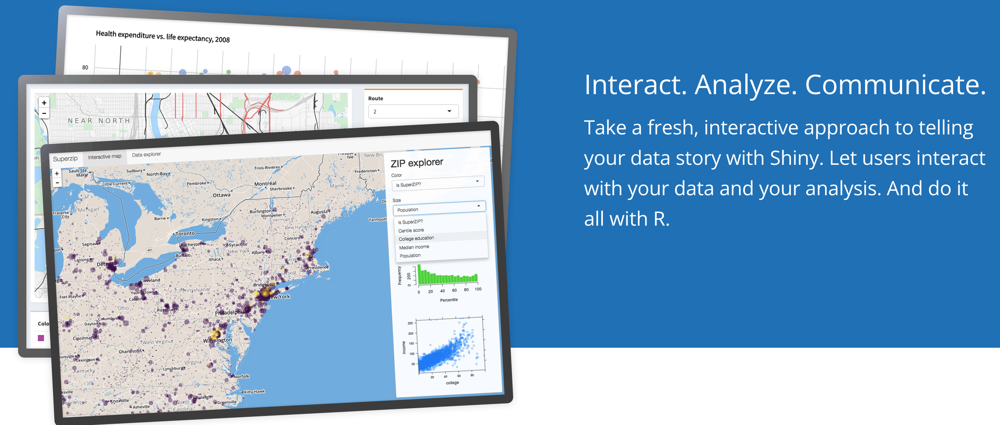
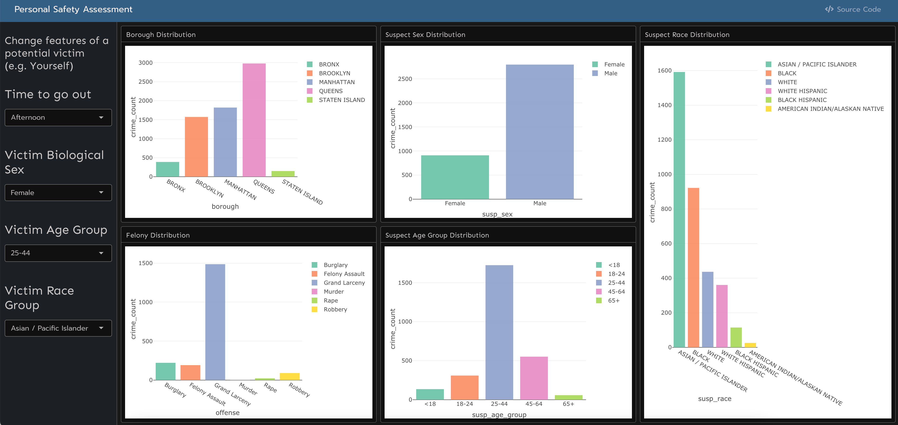

\ \par

\ \par
       
### Notifications for using Shiny

Shiny is a useful framework to create inteactive interfaces and web-based applications for data analysis.  
In this project, we construct two interactive maps and one safety assessment  app based on Shiny App.  

The interactive maps visualize the distribution of seven kinds of felony crimes on the New York City map and offer filters for borough, location, time, victim and suspect.  
We divide the crime data to two maps mainly to avoid memory overflow. As free Shiny developers, we have limited RAM and App users will sometimes disconnect from Shiny server because of large crime dataset size.  
The first map contains data before Covid-19 from 2017 to 2019. The second map has data after Covid-19 from 2020 to 2022.  

  

Explore the first map that has data before Covid-19: [Shiny Map 1](https://shadowshakes.shinyapps.io/app_before_covid/)

Explore the second map that has data after Covid-19: [Shiny Map 2](https://shadowshakes.shinyapps.io/app_after_covid/)

The safety assessment app offers the visualization of potential suspect's feature and also the crimes in different borough, and it is based on the filters of victim's feature(e.g. Yourself) and time period for going out.   

Explore the safety assessment app here: [Shiny Safety Assessment](https://shadowshakes.shinyapps.io/app_detect_safety/)

If you encounter the disconnection, mostly it is caused by limited RAM, and please try to reconnect to the server or avoid selecting too much data in the slider. But if you keep failing to reconnect, it is also possible that our free user's usage of application time has reached the upper limit. In this circumstance or you have any other problem with our Shiny App, please kindly contact us immediately [E-mail](mailto:<sc5154@cumc.columiba.edu>).
Thank you for your cooperation and have fun in our Shiny Apps.

