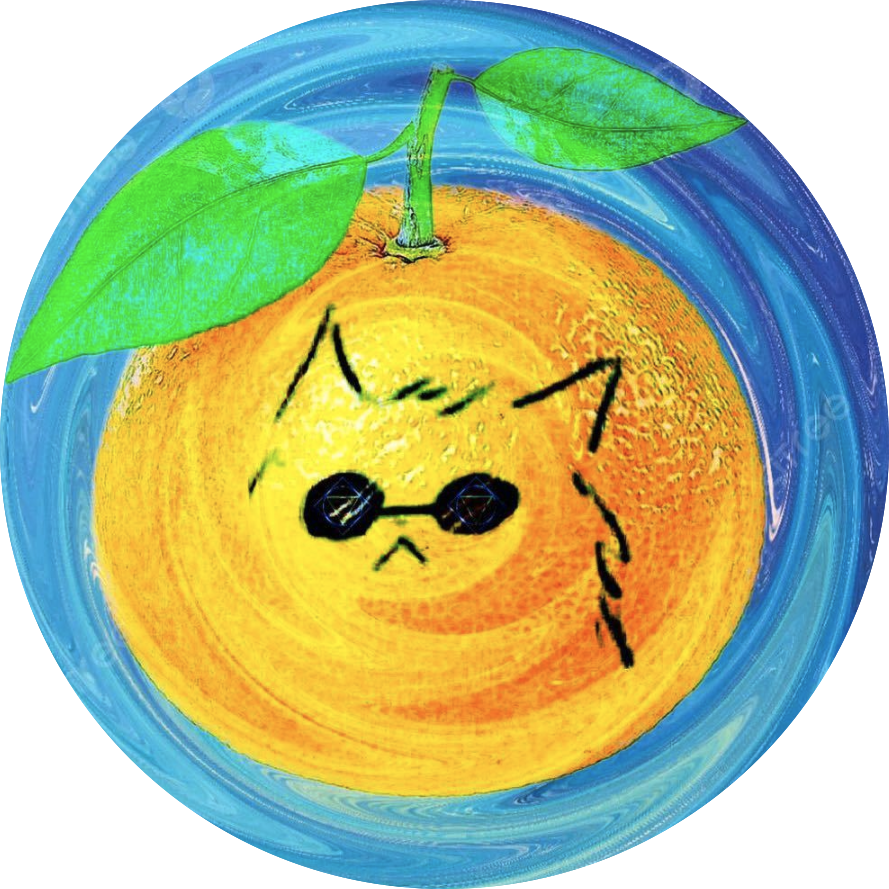

\ \par

\ \par
       
### Group Division

 Our project is mainly divided into the first initial analysis period and the second in-depth analysis period. 

During the first period, we divided the project initial analysis work mainly to five parts, including:\par
* Data tidy and preprocessing
* Data visual analysis
* Statistical analysis
* Regression modelling
* Github front-end website development.

During the second period, we further divided the project in-depth analysis work to five parts, including:\par 
* Suspect analysis
* Victim analysis
* Borough analysis
* Time range analysis
* Shiny interactive design

Each part of the work is completed by one of our team members and checked by all of us.  

In order to keep the front-end website design style to be consistent and save time, in many cases other four team members just sent their revised ".Rmd" file and let front-end designer Shaohan to build and update the project website. Therefore, most of the commits are made by Shaohan according to Github statistics. However, we have to notify that every team member is actively participating in revising the code and analysis descriptions, and everybody is actively updating the project repository which are not completely shown in the commit statistics.  

Thanks again for everyone's participation and contribution to this project!

\ \par

### Team Members

\ \par

\ \par

  \ \ \ \ \ \ \ \ \ ** Jiajun Tao**

* Dataset tidy and basic preprocessing. 
* Crime borough analysis and draft report integration

\ \par
  \ \ \ \ \ \ \ \ \ ** Hongru Tang**

* Statistical prediction modelling. 
* Crime suspect analysis and concluding.

\ \par
  \ \ \ \ \ \ \ \ \ ** Hongjie Liu** 

* Data visualization and further dataset cleaning. 
* Crime time range analysis and project quality&detail control.

\ \par
  \ \ \ \ \ \ \ \ \ ** Shaohan Chen** 

* Project website front-end development, report integration and screen cast. 
* Shiny apps development and CUMC safety analysis.

\ \par
  \ \ \ \ \ \ \ \ \ ** Zijian Xu**

* Statistical testing analysis.
* Crime victim analysis and concluding.

