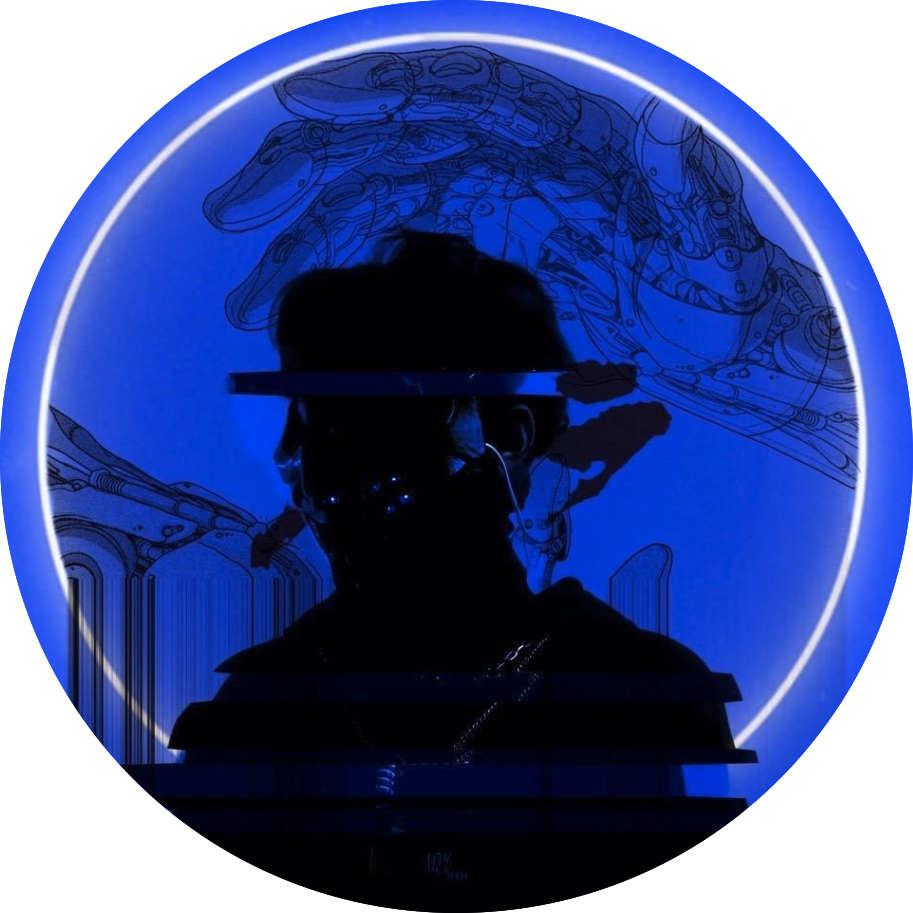

   
\ \par

\ \par

\ \par
       

### Group Division

\ \par

We divided the project work mainly to five parts, including:

* Data tidy and preprocessing
* Data visual analysis
* Statistical analysis
* Regression modelling
* Github front-end website development.

Each part was led by one of our team members, who took main charge of this part and allocated the sub tasks to other members, so that everyone coudld more or less particpated in every section.

\ \par

### Team Members

\ \par

\ \par

  \ \ \ \ \ \ \ \ \ ** Jiajun Tao, MS Biostatistics, Columbia University**

 **Team work**: \par Dataset tidy and preprocessing, help with further analysis. 

\ \par
  \ \ \ \ \ \ \ \ \ ** Hongru Tang, MS Biostatistics, Columbia University**

 **Team work**: \par Statistical Modelling and model interpretation, help with further analysis.   

\ \par
  \ \ \ \ \ \ \ \ \ ** Hongjie Liu, MS Biostatistics, Columbia University ** 

 **Team work**: \par Data visualization and visual analytics, help with further analysis.   

\ \par
  \ \ \ \ \ \ \ \ \ ** Shaohan Chen, MS Biostatistics, Columbia University ** 

 **Team work**: \par Website front-end development and report summarizing, help with further analysis.   

\ \par
  \ \ \ \ \ \ \ \ \ ** Zijian Xu, MS Biostatistics, Columbia University **

 **Team work**: \par Statistical testing and analytics, help with further analysis.   

